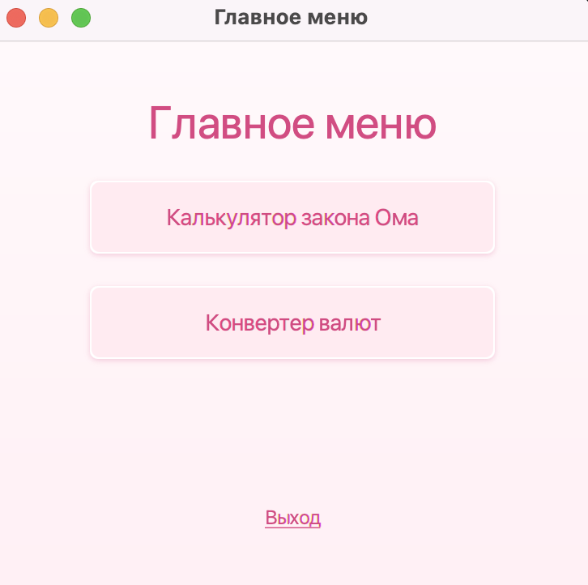
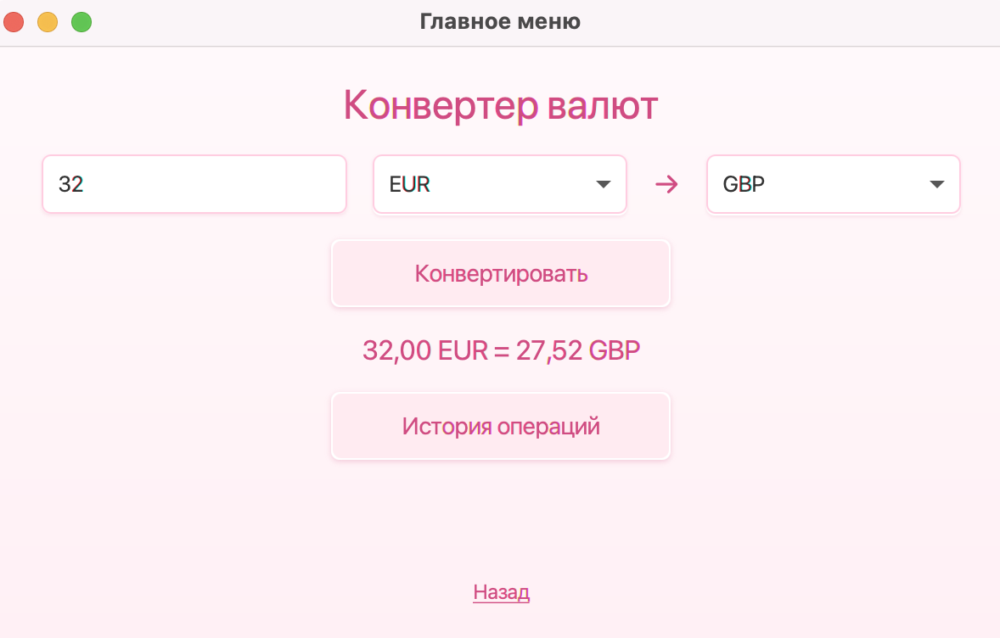
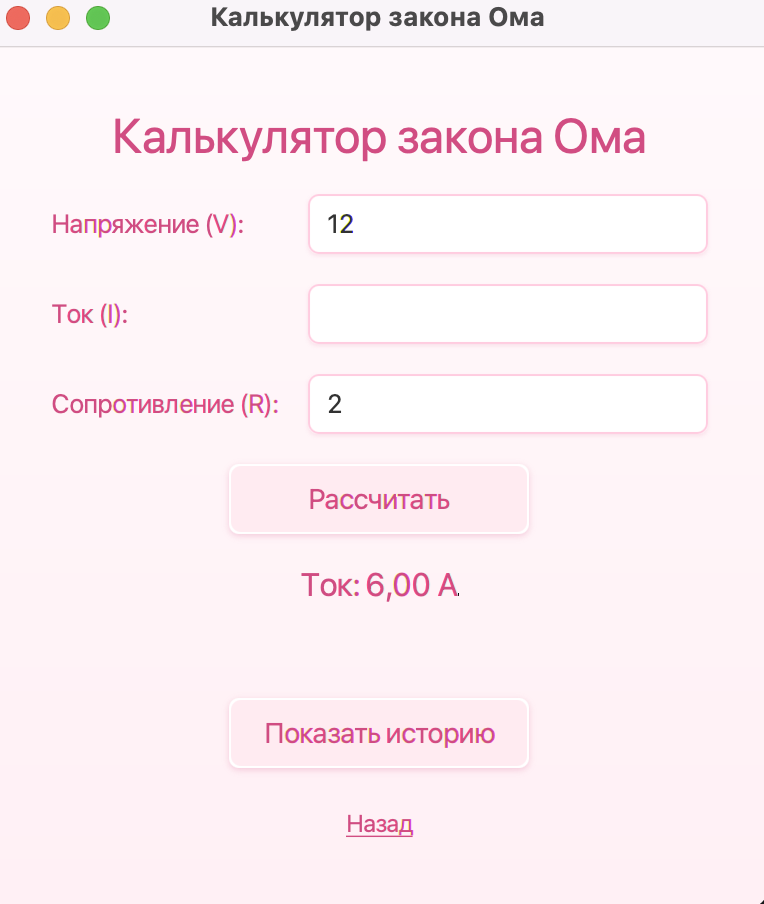

# JavaFX Calculator

Проект представляет собой многофункциональный калькулятор на JavaFX, который включает в себя два основных модуля: калькулятор валют и калькулятор закона Ома.

## 🚀 Функциональность

### 1. Калькулятор валют
- Конвертация между различными валютами
- Актуальные курсы валют (обновляются в реальном времени)
- Поддержка популярных валют: USD, EUR, RUB, KZT и других
- Простой и интуитивно понятный интерфейс

### 2. Калькулятор закона Ома
- Расчет напряжения, силы тока, сопротивления и мощности
- Удобный ввод параметров
- Мгновенные вычисления по формулам:
  - Напряжение (V) = Ток (I) × Сопротивление (R)
  - Ток (I) = Напряжение (V) ÷ Сопротивление (R)
  - Сопротивление (R) = Напряжение (V) ÷ Ток (I)
  - Мощность (P) = Напряжение (V) × Ток (I)

## 📸 Скриншоты

### Главное меню


### Калькулятор валют


### Калькулятор закона Ома


## 🛠 Технологии

- **Java 17+**
- **JavaFX 17+** - для графического интерфейса
- **Maven** - для управления зависимостями и сборки проекта

## 📦 Установка и запуск

### Предварительные требования
- Установленная JDK 17 или выше
- Установленный Maven
- Установленный JavaFX SDK

### Сборка и запуск

1. Клонируйте репозиторий:
```bash
git clone https://github.com/dievavar/javafxCalculator.git
cd javafxCalculator
```

2. Соберите проект с помощью Maven:
```bash
mvn clean compile
```

3. Запустите приложение:
```bash
mvn javafx:run
```

### 🗂 Структура проекта

```
src/
├── main/
│   ├── java/
│   │   └── com/
│   │       └── example/
│   │           └── calculator/
│   │               ├── Main.java          # Главный класс приложения
│   │               ├── CurrencyCalculator.java    # Калькулятор валют
│   │               ├── OhmsLawCalculator.java     # Калькулятор закона Ома
│   │               └── styles.css         # Стили интерфейса
│   └── resources/
│       └── images/                        # Изображения для интерфейса
```

## 💡 Особенности реализации

- **Чистая архитектура** - разделение логики и интерфейса
- **Модульный дизайн** - легко добавлять новые калькуляторы
- **Адаптивный интерфейс** - корректное отображение на разных разрешениях
- **Валидация ввода** - защита от некорректных данных

## 🎨 Интерфейс

Приложение использует современный и минималистичный дизайн с:
- Чистой компоновкой элементов
- Интуитивной навигацией
- Подсветкой активных элементов
- Визуальной обратной связью

## 🔧 Настройка

Для настройки приложения вы можете:
- Изменить стили в файле `styles.css`
- Добавить новые валюты в классе `CurrencyCalculator`
- Настроить цветовую схему интерфейса
